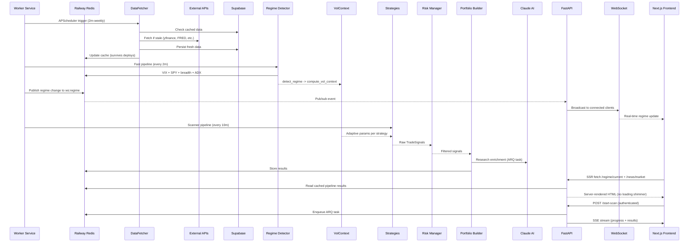
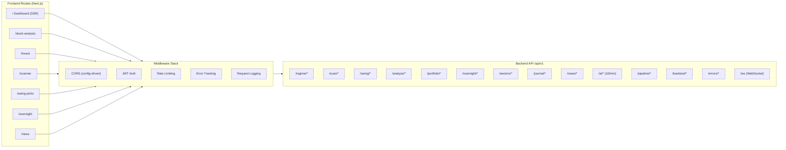
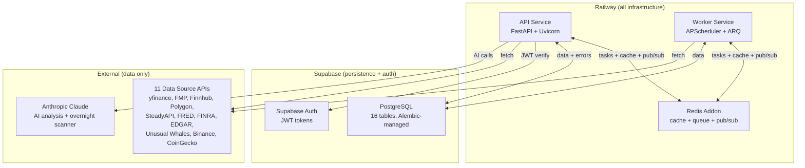

# QuantPulse v3 — Full Architecture Analysis

## System Topology

```mermaid
graph TB
    subgraph clientLayer ["Client Layer"]
        Browser["Browser (User)"]
    end

    subgraph frontendDeploy ["Frontend — Railway"]
        NextJS["Next.js 16 App Router<br/>SSR Dashboard + Client Pages"]
    end

    subgraph backendAPI ["Backend API — Railway Service 1"]
        FastAPI["FastAPI + Uvicorn"]
        subgraph middleware ["Middleware Stack"]
            AuthMW["JWT Auth Middleware<br/>Supabase JWT verification"]
            RateLimiter["Rate Limiter<br/>slowapi per-endpoint"]
            ErrorTracker["Error Tracker<br/>Supabase persistence"]
            RequestLogger["Request Logger<br/>structured JSON + request_id"]
        end
        subgraph coreEngines ["Core Engines"]
            RegimeDetector["Regime Detector<br/>5 regimes, 4 indicators"]
            VolCtx["VolContext<br/>Adaptive Parameters"]
            KellySizer["Kelly Sizing<br/>quarter/half/equal"]
            RiskMgr["Risk Manager<br/>circuit breakers, VaR, correlation"]
            PortfolioBuilder["Portfolio Construction<br/>waterfall pipeline"]
        end
        subgraph strategies ["5 Strategies"]
            StatArb["Stat Arb<br/>pairs, cointegration"]
            Catalyst["Catalyst Event<br/>PEAD, revisions, sweeps, insider"]
            CrossAsset["Cross-Asset Momentum<br/>sector rotation"]
            FlowImbalance["Flow Imbalance<br/>sweeps, dark pool"]
            GapReversion["Gap Reversion<br/>overnight gaps"]
        end
        WSEndpoint["WebSocket /ws<br/>regime, signals, pipeline push"]
    end

    subgraph backendWorker ["Backend Worker — Railway Service 2"]
        Scheduler["APScheduler<br/>2m-weekly jobs"]
        ARQWorker["ARQ Task Queue<br/>retry, timeout, persistence"]
        AlertDispatch["Alert Dispatcher<br/>SendGrid email"]
        AIEngine["Claude AI<br/>market summaries, analysis,<br/>overnight scanner"]
    end

    subgraph infra ["Infrastructure — Railway"]
        Redis["Railway Redis Addon<br/>cache + task broker + pub/sub"]
    end

    subgraph dataLayer ["Data Sources"]
        YFinance["yfinance (free)"]
        FMP["FMP API"]
        Finnhub["Finnhub API"]
        Polygon["Polygon API"]
        SteadyAPI["SteadyAPI"]
        FRED["FRED API"]
        FINRA["FINRA ATS"]
        EDGAR["SEC EDGAR"]
        UW["Unusual Whales"]
        Binance["Binance (free)"]
        CoinGecko["CoinGecko (free)"]
    end

    subgraph persistence ["Persistence — Supabase"]
        SupabaseDB["PostgreSQL<br/>16 tables + Alembic migrations"]
        SupabaseAuth["Supabase Auth<br/>JWT verification"]
    end

    Browser -->|"HTTPS"| NextJS
    NextJS -->|"REST + SSE + WebSocket"| FastAPI
    FastAPI --> middleware
    FastAPI --> RegimeDetector
    FastAPI --> PortfolioBuilder
    RegimeDetector --> VolCtx
    VolCtx --> strategies
    strategies --> RiskMgr
    RiskMgr --> KellySizer
    KellySizer --> PortfolioBuilder
    FastAPI -->|"enqueue tasks"| Redis
    Redis -->|"dequeue tasks"| ARQWorker
    FastAPI -->|"WebSocket pub/sub"| Redis
    Redis -->|"publish events"| backendWorker
    backendWorker -->|"pub/sub"| Redis
    FastAPI -->|"cache read/write"| Redis
    Scheduler -->|"cache read/write"| Redis
    FastAPI -->|"supabase-py client"| SupabaseDB
    SupabaseAuth -->|"JWT secret"| AuthMW
    ErrorTracker -->|"error_events table"| SupabaseDB
    FastAPI --> YFinance
    FastAPI --> FMP
    FastAPI --> Finnhub
    FastAPI --> Polygon
    FastAPI --> SteadyAPI
    FastAPI --> FRED
    FastAPI --> FINRA
    FastAPI --> EDGAR
    FastAPI --> UW
    FastAPI --> Binance
    FastAPI --> CoinGecko
```

---

## Data Flow

---

## Request/Response Architecture

---

## Stack

| Layer | Technology | Purpose |
|-------|-----------|---------|
| Frontend | Next.js 16 (App Router) | SSR dashboard, client-side pages, Tailwind + shadcn UI |
| Backend API | FastAPI + Uvicorn | REST API, SSE streams, WebSocket endpoint |
| Backend Worker | Python + APScheduler + ARQ | Scheduled jobs, background task processing |
| Cache / Queue / Pub/Sub | Railway Redis | Three-tier cache, ARQ task broker, WebSocket event bus |
| Database | Supabase PostgreSQL | 16 tables, Alembic-managed migrations |
| Auth | Supabase Auth | JWT token verification, feature-flagged |
| AI | Anthropic Claude | Market summaries, ticker analysis, research enrichment, overnight scanner reasoning |
| Data Sources | 11 APIs | yfinance, FMP, Finnhub, Polygon, SteadyAPI, FRED, FINRA, EDGAR, Unusual Whales, Binance, CoinGecko |
| Deployment | Railway (from GitHub) | API service + Worker service + Redis addon |

---

## Pros

**1. Adaptive-Everything Design**
Zero hardcoded thresholds -- every parameter is a function of `VolContext` (VIX level, term structure, ATR, correlation, breadth). The system self-adjusts to low-vol vs crisis regimes without manual intervention.

**2. Multi-Strategy Diversification with Regime Gating**
Five uncorrelated strategy types (mean-reversion, event-driven, momentum, flow, intraday) with regime-aware weight blending via `compute_blended_weights()`. Strategy circuit breakers auto-pause losing strategies (20d drawdown > -10% = 20d pause).

**3. Defense-in-Depth Risk Management**
Risk checks are layered: position limits -> circuit breakers -> exposure caps -> sector concentration -> correlation haircut -> VaR check -> drawdown flatten/reduce. The `RiskManager.check_trade()` waterfall is thorough.

**4. Clean Separation of Concerns**
Backend is well-modularized: `strategies/`, `adaptive/`, `regime/`, `risk/`, `data/`, `signals/`, `tracker/`, `ai/`, `alerts/`, `middleware/`, `tasks/`, `websocket/` are each self-contained. Strategies inherit from `BaseStrategy` ABC.

**5. Graceful Degradation on Data Sources**
Paid sources are feature-flagged (`enable_polygon`, `enable_steadyapi`, etc.). The system falls back to yfinance (free) when paid APIs are disabled. `DataFetcher` reads Supabase first, then paid, then free.

**6. Three-Tier Cache with Redis Primary**
Redis (Railway addon) is the primary cache with native TTL. Falls back to in-memory dict if Redis is unavailable, with Supabase as durable persistence for critical pipeline keys. Cache survives deploys -- no more 5-10 minute cold starts.

**7. Real-Time Push via WebSocket + SSE**
WebSocket endpoint (`/ws`) with Redis pub/sub for regime changes, trade signals, and pipeline status. SSE for scan progress. The `useWebSocket` hook auto-reconnects with exponential backoff.

**8. Full Middleware Stack**
Every request passes through: CORS (config-driven origins) -> JWT Auth (Supabase, feature-flagged) -> Error Tracking (Supabase persistence) -> Request Logging (structured JSON with `request_id` and `duration_ms`). Rate limiting via slowapi (60/min default, 10/min AI, 5/min scans).

**9. SSR Dashboard**
The main dashboard (`/`) uses Next.js server components to fetch regime and news data server-side. First paint renders real data -- no loading shimmer. AI summaries load client-side as progressive enhancement.

**10. Pydantic Everywhere + AI-Augmented Analysis**
Config, data models, and API schemas all use Pydantic. Claude integration for market summaries, ticker picking, and research enrichment adds a qualitative layer on top of quantitative signals.

**11. AI Overnight Swing Scanner with Feedback Loop**
Separate module that bypasses hardcoded strategy logic entirely. Fetches raw data from 8 APIs in parallel (8-worker ThreadPoolExecutor with retry/backoff), computes RSI/Bollinger/ATR/volume in Python, pre-filters to cut token cost 60-70%, discovers dynamic movers via Polygon gainers/losers and Binance top movers, then sends only interesting tickers to Claude for pure reasoning. Prompt includes cross-asset correlation checks, sector clustering detection, liquidity validation, confidence calibration, and anti-fabrication rules. Morning-after scorecard (9:35 AM cron) automatically checks outcomes against actual opening prices, computes win rate/calibration/streaks, and feeds real performance data back into Claude's prompt for self-correction. Tiered caching (FRED 12h, SEC 6h, snapshots 15min) minimizes API calls. Cost tracking logs every Claude call's token usage and USD cost.

---

## Previously Identified Cons -- Resolution Status

| # | Con | Status | Resolution |
|---|-----|--------|------------|
| 1 | Single-Process Monolith | **Fixed** | Split into API + Worker services. Worker runs APScheduler and ARQ task queue. API is stateless, horizontally scalable. |
| 2 | No Authentication | **Fixed** | Supabase JWT middleware on backend, AuthGate + Supabase client on frontend. Feature-flagged (`AUTH_ENABLED`). CORS locked to config-driven origins. |
| 3 | In-Memory Cache = State Loss | **Fixed** | Redis (Railway addon) as primary cache. In-memory as fallback. Supabase as durable backup for critical keys. Cache survives deploys. |
| 4 | No Database Migration System | **Fixed** | Alembic set up with baseline migration + `error_events` table. `make migrate` / `make migrate-create` commands. |
| 5 | ThreadPoolExecutor | **Fixed** | ARQ task queue backed by Redis. 3 retries, exponential backoff, timeout, result persistence. Falls back to ThreadPoolExecutor if Redis is unavailable. |
| 6 | All Pages Client-Side Rendered | **Fixed** | Dashboard uses server components for initial regime + news data. No loading shimmer on first paint. |
| 7 | Config Drift | **Fixed** | `.env.example` fully aligned with `config.py`. Removed `KELLY_FRACTION`, added `SIZING_MODE`, all new fields documented. |
| 8 | No Rate Limiting | **Fixed** | slowapi middleware with per-endpoint limits: 60/min default, 10/min AI, 5/min scans. |

---

## Additional Infrastructure

| Feature | Implementation | Details |
|---------|---------------|---------|
| **Error Tracking** | Supabase `error_events` table | Middleware captures unhandled exceptions with stack traces, deduplicates by type+message, tracks occurrence counts. `/api/v1/errors/recent` endpoint for viewing. Frontend error boundary reports to same table. |
| **Structured Logging** | JSON to stdout (Railway native) | Every log line is JSON with `ts`, `level`, `logger`, `msg`, `request_id`, `duration_ms`, `strategy`. Searchable in Railway's log viewer. |
| **WebSocket Support** | Redis pub/sub + FastAPI WebSocket | Three channels: `ws:regime`, `ws:signals`, `ws:pipeline`. Worker publishes events, API broadcasts to connected clients. Auto-reconnect on frontend. |
| **Overnight Scorecard** | Cache-based pick logging + Polygon/Binance outcome checks | Every BUY pick logged with entry price; 9:35 AM cron fetches opening prices and computes actual P&L. Win rate, confidence calibration, sector breakdown, streaks. Performance summary auto-injected into Claude's prompt. |
| **Cost Tracking** | Per-scan token + USD logging | Every Claude API call logs input/output tokens and estimated cost. `GET /overnight/history` returns rolling cost summary. |
| **Makefile** | Common commands | `make run`, `make worker`, `make dev`, `make test`, `make lint`, `make migrate`, `make install` |

---

## Remaining Gaps

| Category | Status | Impact | Effort |
|----------|--------|--------|--------|
| **CI/CD Pipeline** | Not implemented | Railway deploys on every push with no lint/test gates. Broken code can ship. | Low (~30 min GitHub Actions YAML) |
| **Containerization** | Not implemented | Cannot reproduce exact production environment locally. | Medium (Dockerfile + docker-compose) |
| **APM / Metrics** | Not implemented | No visibility into response time percentiles, throughput, or resource usage beyond structured logs. | Medium (Prometheus + Grafana or Railway metrics) |
| **Secrets Management** | Plain `.env` | API keys in environment variables with no rotation policy. Railway env vars are encrypted at rest. | Low-Medium (Railway handles production secrets) |
| **Load Testing** | Not implemented | Unknown breaking points and capacity limits. | Low (k6 or Locust script) |
| **Backup / DR** | Supabase defaults only | Data loss risk if Supabase has issues. | Low (Supabase has daily backups on Pro plan) |

---

## Infrastructure Summary

**Two platforms, zero third-party services:**

- **Railway** -- API service, Worker service, Redis addon, structured log search, deployment from GitHub
- **Supabase** -- PostgreSQL (16 tables + error_events), Auth (JWT), daily backups

---

## Key File Paths

| Component | Path |
|-----------|------|
| API entry point | `backend/main.py` |
| Worker entry point | `worker.py` |
| API router | `backend/api/router.py` |
| Config | `backend/config.py` |
| Redis client | `backend/redis_client.py` |
| Cache (3-tier) | `backend/data/cache.py` |
| Auth middleware | `backend/middleware/auth.py` |
| Error tracking middleware | `backend/middleware/error_tracking.py` |
| Request logging middleware | `backend/middleware/request_logging.py` |
| Structured logging | `backend/logging_config.py` |
| WebSocket manager | `backend/websocket/manager.py` |
| WebSocket routes | `backend/websocket/routes.py` |
| ARQ task queue | `backend/tasks/queue.py` |
| ARQ worker | `backend/tasks/worker.py` |
| Scheduler | `backend/scheduler.py` |
| Base strategy | `backend/strategies/base.py` |
| Regime detector | `backend/regime/detector.py` |
| VolContext | `backend/adaptive/vol_context.py` |
| Kelly sizing | `backend/adaptive/kelly_adaptive.py` |
| Risk manager | `backend/risk/manager.py` |
| Data fetcher | `backend/data/fetcher.py` |
| Pydantic schemas | `backend/models/schemas.py` |
| Supabase client | `backend/models/database.py` |
| Alembic config | `alembic.ini` |
| Migrations | `backend/migrations/alembic/versions/` |
| SQL baseline | `backend/migrations/001_init.sql` |
| Makefile | `Makefile` |
| Railway config | `railway.toml` |
| Frontend API client | `frontend-next/src/lib/api.ts` |
| Supabase client (frontend) | `frontend-next/src/lib/supabase.ts` |
| Auth gate | `frontend-next/src/components/auth-gate.tsx` |
| Error boundary | `frontend-next/src/components/error-boundary.tsx` |
| WebSocket hook | `frontend-next/src/hooks/use-websocket.ts` |
| SSR dashboard | `frontend-next/src/app/page.tsx` |
| Dashboard client | `frontend-next/src/app/dashboard-client.tsx` |
| Overnight scanner API | `backend/api/overnight.py` |
| Overnight data sources | `backend/data/sources/overnight_src.py` |
| Overnight scanner prompt | `backend/prompts/overnight_scanner.txt` |
| Overnight scanner page | `frontend-next/src/app/overnight/page.tsx` |
| News page | `frontend-next/src/app/news/page.tsx` |
