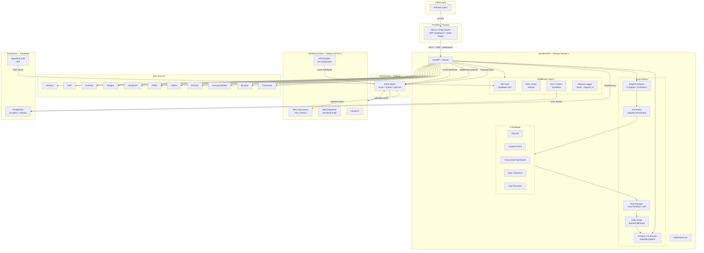
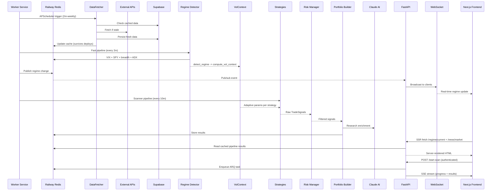
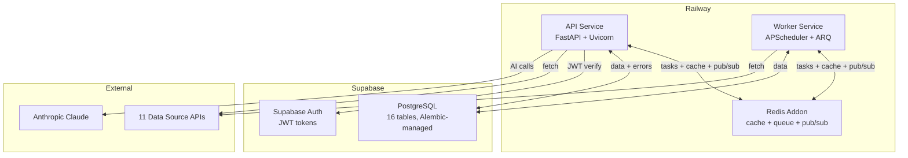

# QuantPulse v3 -- Multi-Strategy Quantitative Trading Advisory System

QuantPulse is a full-stack signal-generation and decision-support system for quantitative equity trading. It does **not** place trades, connect to brokers, or move money. It is a human-in-the-loop advisory cockpit: the system generates high-conviction trade ideas backed by math, and the human decides what to execute.

## System Architecture



## Stack

| Layer | Technology | Purpose |
|-------|-----------|---------|
| Frontend | Next.js 16 (App Router) | SSR dashboard, client-side pages, Tailwind + shadcn UI |
| Backend API | FastAPI + Uvicorn | REST API, SSE streams, WebSocket endpoint |
| Backend Worker | Python + APScheduler + ARQ | Scheduled jobs, background task processing |
| Cache / Queue / Pub/Sub | Railway Redis | Three-tier cache, ARQ task broker, WebSocket event bus |
| Database | Supabase PostgreSQL | 16 tables, Alembic-managed migrations |
| Auth | Supabase Auth | JWT token verification, feature-flagged |
| AI | Anthropic Claude | Market summaries, ticker analysis, research enrichment, overnight scanner reasoning |
| Data Sources | 11 APIs | yfinance, FMP, Finnhub, Polygon, SteadyAPI, FRED, FINRA, EDGAR, Unusual Whales, Binance, CoinGecko |
| Deployment | Railway (from GitHub) | API service + Worker service + Redis addon |

## What We Are Trying to Achieve

Most retail trading tools rely on indicators like RSI, MACD, and Bollinger Bands. These signals have zero alpha -- everyone computes the same thing, so there is no informational edge. Institutions don't trade this way. They find **structural edges**: mispricings that exist for a mathematical reason and persist because of capacity constraints or execution difficulty.

QuantPulse targets **risk-adjusted alpha** -- portfolio Sharpe > 1.5, max drawdown < 15%, positive net returns after transaction costs. It combines multiple complementary signal engines, each with a documented structural reason for why the edge exists. No single strategy carries the system. The return comes from diversification across complementary alpha streams, regime-aware capital allocation, and conservative position sizing.

Every signal must answer three questions:

1. **Why does this edge exist?** (structural reason, not pattern-matching)
2. **Why hasn't it been arbitraged away?** (capacity constraint, holding period, execution difficulty)
3. **What kills this edge?** (regime change, crowding, data disappearing)

## Signal Engines

### Strategy 1: Statistical Arbitrage (Pairs/Baskets)

Two stocks in the same sector share common risk factors. When their price spread diverges beyond what fundamentals justify, it mean-reverts. We find cointegrated pairs using three statistical tests (ADF, Engle-Granger, Johansen -- require 2-of-3 to pass at p < 0.01), compute the half-life of mean reversion via the Ornstein-Uhlenbeck process, and trade the z-score of the spread. Pairs are filtered for minimum 252-day correlation > 0.70, liquidity > $5M daily volume, and ongoing Hurst exponent monitoring (H must stay < 0.5).

### Strategy 2: Catalyst-Driven Event Trading

Markets systematically misprice the magnitude and timing of catalysts. Post-Earnings Announcement Drift (PEAD) is one of the most well-documented anomalies in finance. We score earnings surprises, analyst revision momentum, management guidance detection, insider buying clusters, and institutional options flow sweeps, with sector context from the regime engine.

### Strategy 3: Cross-Asset Regime Signals

Equity sectors respond to macro signals (yields, VIX, commodities, credit, dollar, market breadth) with a lag. We track 9 cross-asset indicators, compute rolling z-scores against their 60-day distributions, and use the results to tilt capital allocation and validate other strategies' signals.

### Strategy 4: Microstructure & Flow Imbalance

Institutional direction is detected through options sweep flow (large call/put sweeps via SteadyAPI) and dark pool accumulation patterns (FINRA ATS weekly data showing persistent institutional buying). Options sweep flow is near-real-time and actionable for 3-10 day holds.

### Strategy 5: Overnight Gap Mean Reversion

Overnight gaps between 1-5% revert 60-65% of the time within the first 90 minutes. We filter for non-catalyst gaps, require historical fill rates above 60% per ticker, and gate on VIX < 30.

### AI Overnight Swing Scanner

A separate pure-AI module that bypasses the strategy engines entirely. Instead of hardcoded signal logic, it fetches raw data from 8 APIs (Polygon, FRED, Binance, CoinGecko, SEC EDGAR, FINRA ATS, Fear & Greed Index), computes technical indicators in Python (RSI, Bollinger Bands, ATR, volume ratios), pre-filters for activity, and sends only interesting tickers to Claude for reasoning.

**Architecture:**
- **Parallel data fetching** (8-worker ThreadPoolExecutor) with retry and exponential backoff
- **Tiered caching**: FRED 12h, SEC EDGAR 6h, Polygon snapshots 15min
- **Numeric pre-filter** before Claude: volume spike >1.5x, price move >2%, RSI extremes, Bollinger breakouts, insider filings. Cuts Anthropic API cost 60-70%
- **Dynamic universe discovery**: Polygon gainers/losers and Binance top movers expand the base watchlist
- **Live prices**: Polygon snapshot price during market hours, last daily close on weekends
- **Weekend awareness**: stock picks framed as Monday trades, crypto picks are live immediately

**Prompt engineering** includes cross-asset correlation checks (don't recommend NVDA long + ETH long = doubled risk-off exposure), sector clustering detection, liquidity validation (skip sub-500K volume stocks), confidence calibration rubric, price anchoring (entry must be within 1% of actual price), and anti-fabrication rules for insider data.

**Morning Scorecard** closes the feedback loop:
- Every BUY pick is logged with actual entry price, scan date, and confidence
- At 9:35 AM ET the next trading day, a cron job fetches opening prices and computes actual returns
- Running scorecard: win rate, avg return, W-L record, current streak, confidence calibration by bucket (do 80+ picks actually win more?), sector breakdown
- Performance summary feeds back into Claude's prompt: *"Your last 7 days: 5/8 won (+1.8% avg). Confidence 80+: 4/5 won. Fintech picks: 1/3 -- reduce exposure."*
- Claude self-corrects over time based on actual outcomes

**Cost tracking**: every Claude call logs input/output tokens and USD cost. `GET /overnight/history` returns cost summary.

## Data Flow



## Signal Pipeline

```
Strategy generates TradeSignal
        |
        v
+---------------------+
|  Tradability Gate   |  %ADV check, slippage estimate,
|                     |  borrow heuristic, spread width
+--------+------------+
         v
+---------------------+
|  Shadow Evidence    |  Similar phantom trades in last 90d:
|                     |  win rate, avg hold, realized Sharpe
+--------+------------+
         v
+---------------------+
|  Strategy Health    |  Rolling 60d Sharpe, degradation
|                     |  detection, regime alignment
+--------+------------+
         v
    EnrichedSignal
    final_recommendation: trade / conditional / do_not_trade
```

Each enriched signal includes:

- **Tradability**: projected slippage (bps), position as % of daily volume, borrow availability for shorts
- **Shadow evidence**: count of similar phantom trades, win rate, average P&L, realized Sharpe from the last 90 days
- **Strategy health**: rolling 60-day Sharpe, whether performance is deteriorating, regime alignment
- **Final recommendation**: `trade`, `conditional_trade`, or `do_not_trade`

## Core Engines

**Regime Detection** classifies the market into one of five states (bull trending, bull choppy, bear trending, crisis, mean-reverting) using four indicator pillars (VIX, breadth, ADX, cross-asset confirmation). The regime determines how much capital each strategy receives.

**Adaptive Parameters** -- zero hardcoded thresholds. Every parameter is a function of `VolContext` (VIX level, term structure, ATR, correlation, breadth). The system self-adjusts to low-vol vs crisis regimes without manual intervention.

**Position Sizing** defaults to quarter-Kelly (conservative). After validation through paper trading, upgradeable to half-Kelly. Recalibrates from a rolling 100-trade window, capped per-strategy.

**Risk Management** runs four layers: position limits (8% max) -> strategy circuit breakers (pause at -5% drawdown, shutdown at -10%) -> portfolio limits (gross/net exposure, sector concentration, VaR, correlation, drawdown) -> optional tail-risk overlays.

**Shadow Book** automatically logs every generated signal as phantom trades. Daily scheduler tracks outcomes (stop hit, target hit, timed out). Builds the evidence base for edge validation.

## Infrastructure

### API Response Envelope

All endpoints return a consistent shape:

```json
{
  "data": {},
  "meta": {
    "request_id": "abc123",
    "timestamp": "2026-03-21T...",
    "cached": false
  },
  "errors": null
}
```

### Middleware Stack

Every request passes through: CORS (config-driven origins) -> JWT Auth (Supabase, feature-flagged) -> Error Tracking (Supabase persistence with deduplication) -> Request Logging (structured JSON with `request_id` and `duration_ms`). Rate limiting: 60/min default, 10/min AI, 5/min scans.

### Three-Tier Cache

Redis (Railway addon) is the primary cache with native TTL. Falls back to in-memory dict if Redis is unavailable. Supabase as durable persistence for critical pipeline keys. Cache survives deploys.

### Real-Time Push

WebSocket endpoint (`/ws`) with Redis pub/sub for regime changes, trade signals, and pipeline status. SSE for scan progress. Three channels: `ws:regime`, `ws:signals`, `ws:pipeline`.

### Task Queue

ARQ (async Redis queue) with 3 retries, exponential backoff, timeout, and result persistence. Falls back to ThreadPoolExecutor when Redis is unavailable. Redis-backed `TaskState` enables cross-process SSE polling.

### Error Tracking

Middleware captures unhandled exceptions with stack traces, deduplicates by type+message, persists to Supabase `error_events` table. `/api/v1/errors/recent` for viewing. Frontend error boundary reports to the same table.

### Database Migrations

Alembic with baseline migration from existing schema. `make migrate` to apply, `make migrate-create` to generate new migrations.

## API Endpoints

| Module | Prefix | Key Endpoints |
|--------|--------|---------------|
| Regime | `/regime` | `GET /current`, `GET /history` |
| Scanner | `/scan` | `GET /`, `POST /start-scan`, `GET /status`, `GET /stream` |
| Analyzer | `/analyze` | `GET /{ticker}`, `POST /start`, `GET /status`, `GET /stream` |
| Portfolio | `/portfolio` | `GET /state`, `GET /quick-allocate`, `POST /quick-allocate/start`, `GET /quick-allocate/stream` |
| Sectors | `/sectors` | `GET /recommendations`, `POST /start-recs`, `GET /stream` |
| Swing | `/swing` | `GET /picks`, `POST /start-scan`, `GET /stream` |
| Overnight | `/overnight` | `POST /start-scan`, `GET /status`, `GET /stream`, `GET /scorecard`, `POST /check-outcomes`, `GET /history` |
| Journal | `/journal` | `POST /trades`, `POST /trades/{id}/exit`, `GET /trades/active`, `GET /performance` |
| AI | `/ai` | `POST /summarize` |
| News | `/news` | `GET /market`, `GET /ticker/{ticker}` |
| Pipeline | `/pipeline` | `GET /status`, `POST /refresh`, `GET /flow`, `GET /earnings-calendar` |
| Errors | `/errors` | `GET /recent`, `POST /{id}/resolve`, `POST /report` |
| Backtest | `/backtest` | `POST /seed`, `GET /status` |
| WebSocket | `/ws` | Real-time push (regime, signals, pipeline) |
| Health | `/health` | `GET /` (status, version, redis, auth) |

## Quick Start

```bash
# Install dependencies
make install

# Set up environment
cp .env.example .env
# Fill in your API keys and Supabase/Redis credentials

# Run database migrations
make migrate

# Start backend + frontend
make dev

# Or run separately
make run      # Backend on :8000
make frontend # Frontend on :3000
make worker   # Background worker (APScheduler + ARQ)
```

## Testing

```bash
make test   # Run all tests (24 integration + unit tests)
make lint   # Run ruff linter
make fix    # Auto-fix lint errors
```

## Deployment

Deployed on Railway from GitHub with two services:

- **API Service**: `uv run uvicorn backend.main:app --host 0.0.0.0 --port $PORT`
- **Worker Service**: `uv run python worker.py`
- **Redis Addon**: cache + task queue broker + WebSocket pub/sub

Database on Supabase (PostgreSQL). Auth via Supabase JWT (feature-flagged).



## Project Structure

```
backend/
  api/            # FastAPI route modules (13 routers + envelope helper)
  adaptive/       # VolContext, thresholds, Kelly, stops, regime calibration
  regime/         # Regime detector, indicators, transitions
  risk/           # Risk manager, VaR, Kelly, correlation, tail hedge
  strategies/     # 5 strategy implementations + BaseStrategy ABC
  data/           # DataFetcher, cache, universe, rate limiter, 11 source adapters
  signals/        # Cointegration, earnings, revisions, sentiment, DCF
  tracker/        # Trade journal, strategy performance, signal audit, shadow book
  ai/             # Claude AI integration (market summaries, analysis, overnight scanner)
  prompts/        # LLM system prompts (.txt), including overnight_scanner
  alerts/         # Alert dispatcher (SendGrid email; ntfy + Slack scaffolded)
  middleware/     # Auth, error tracking, request logging
  tasks/          # ARQ task queue, TaskState, worker
  websocket/      # WebSocket manager, routes, Redis pub/sub
  models/         # Pydantic schemas, Supabase client
  migrations/     # Alembic migrations + SQL baseline
  logging_config.py
  redis_client.py
  config.py
  scheduler.py
  pipeline.py
  main.py

frontend-next/
  src/app/        # Next.js pages (dashboard, scanner, swing, overnight, news, invest)
  src/components/ # UI components (shadcn, auth gate, error boundary, trade cards)
  src/hooks/      # useSSEScan, useWebSocket
  src/lib/        # API client, Supabase client, types, utils
  src/context/    # React context providers

worker.py         # Worker entry point (APScheduler + ARQ)
Makefile          # Common commands
railway.toml      # Railway deployment config
alembic.ini       # Alembic migration config
pyproject.toml    # Python dependencies
```

## Validation Infrastructure

- **Walk-forward backtesting**: rolling train/test windows with transaction costs, statistical validation (Bonferroni correction, bootstrap Sharpe CI, permutation tests)
- **Paper-trade shadow book**: every signal auto-logged with regime/VIX/ATR context, phantom outcomes tracked daily
- **Strategy health monitoring**: rolling Sharpe from phantom outcomes, slippage deterioration detection, automatic pause when performance degrades
- **Overnight scorecard**: automated morning-after outcome checking (9:35 AM ET cron) with win rate, confidence calibration, sector breakdown, streak tracking. Performance memory feeds back into Claude's prompt for self-correction
- **Cost tracking**: per-scan Claude API token usage and USD cost logging
- **Backtest CLI**: `python scripts/run_backtest.py --strategy stat_arb --years 3`
- **Integration tests**: 24 tests covering health, envelope shape, auth, rate limiting, error tracking
